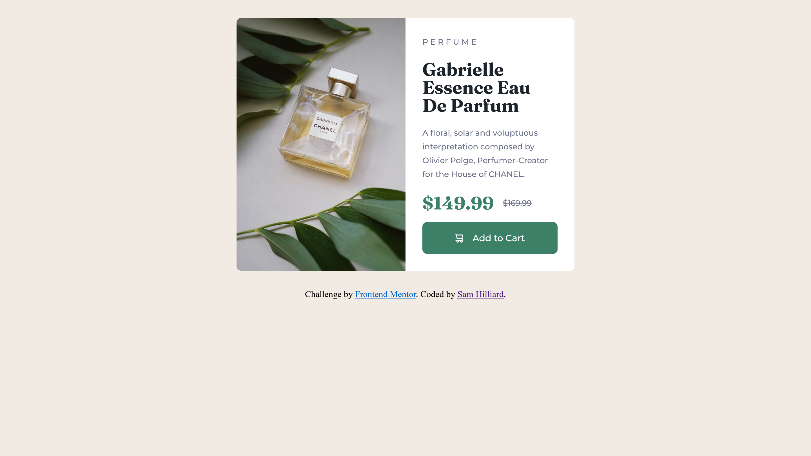
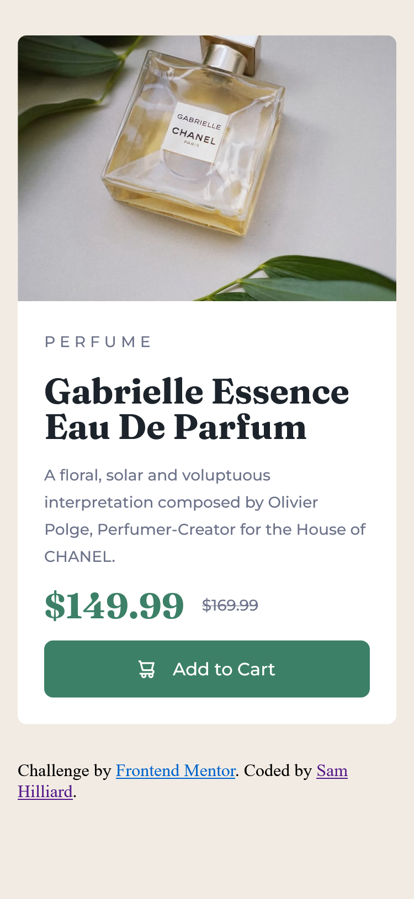

# Frontend Mentor - Product preview card component solution

This is a solution to the [Product preview card component challenge on Frontend Mentor](https://www.frontendmentor.io/challenges/product-preview-card-component-GO7UmttRfa). Frontend Mentor challenges help you improve your coding skills by building realistic projects. 

## Table of contents

- [Frontend Mentor - Product preview card component solution](#frontend-mentor---product-preview-card-component-solution)
  - [Table of contents](#table-of-contents)
  - [Overview](#overview)
    - [The challenge](#the-challenge)
    - [Screenshot](#screenshot)
    - [Links](#links)
  - [My process](#my-process)
    - [Built with](#built-with)
    - [What I learned](#what-i-learned)
    - [Continued development](#continued-development)
    - [Useful resources](#useful-resources)
  - [Author](#author)
  - [Acknowledgments](#acknowledgments)

**Note: Delete this note and update the table of contents based on what sections you keep.**

## Overview

### The challenge

Users should be able to:

- View the optimal layout depending on their device's screen size
- See hover and focus states for interactive elements

### Screenshot

### Links

- [solution code](https://github.com/sam-hilliard/product-preview-card-component)
- [site](https://sam-hilliard.github.io/product-preview-card-component/)

## My process

I started by going over the style guide and linking a style sheet
and declaring global vars for the font and color scheme.

Then, I added some divs with classes to make creating my layout
and styling a little easier. This plan also helps me to visualize
how my layout is going to work.

I also used the `<picture>` tag to provide different images for
the two viewport sizes.

As a firm believer in mobile-first design, I completed the mobile
design first by styling the colors and fonts. Then I tackled the
layout using grid.

I try to use as little fixed widths and heights as possible to make
my code as responsive as possible.

After making the mobile layout, the desktop layout was easy. All I
did was add a second column to my grid layout from earlier and touched
up the padding and that was that!

### Built with

- HTML
- CSS
- CSS Grid

### What I learned

I learned the value of mobile first designs and the power of using
as little rigid dimmension specifications as possible. I've watched
a lot of [Kevin Powel's videos](https://www.youtube.com/channel/UCJZv4d5rbIKd4QHMPkcABCw)
on YouTube recently and he preaches sparingly using fixed heights and widths because
HTML elements are inherintly responsive. It's usually our own CSS rules that break
the responsiveness. So, I got to practice what he preaches in this challenge.

I've also recently learned CSS Grid, so I got to use it a bit here. I used to use
Flex-box for everything and using Grid has saved me so much time and effort.
I love it!

### Continued development

In future projects, I'd like to apply more skills involving frameworks
and Javascript. Maybe I'll do one of the more functional projects on here
again soon! Loved this challenge!

### Useful resources

- [Kevin Powel's YT Channel](https://www.youtube.com/channel/UCJZv4d5rbIKd4QHMPkcABCw) - Great content for everything front-end related. And he has free courses on his main site!
- [CSS Trick's Grid Guide](https://css-tricks.com/snippets/css/complete-guide-grid/) - Such a great article for getting a comprehensive exposure to grid layouts.

## Author

- Website - [Sam Hilliard](https://sam-hilliard.github.io/)
- Frontend Mentor - [@samhill15](https://www.frontendmentor.io/profile/samhill15)
- GitHub - [@sam-hilliard](https://github.com/sam-hilliard)
- LinkedIn - [Sam Hilliard](https://www.linkedin.com/in/sam-hilliard-35941b1aa/)

## Acknowledgments

Huge shout-out to Kevin Powel's content on YouTube. I highly recommend
checking out his [courses](https://www.kevinpowell.co/courses/)!